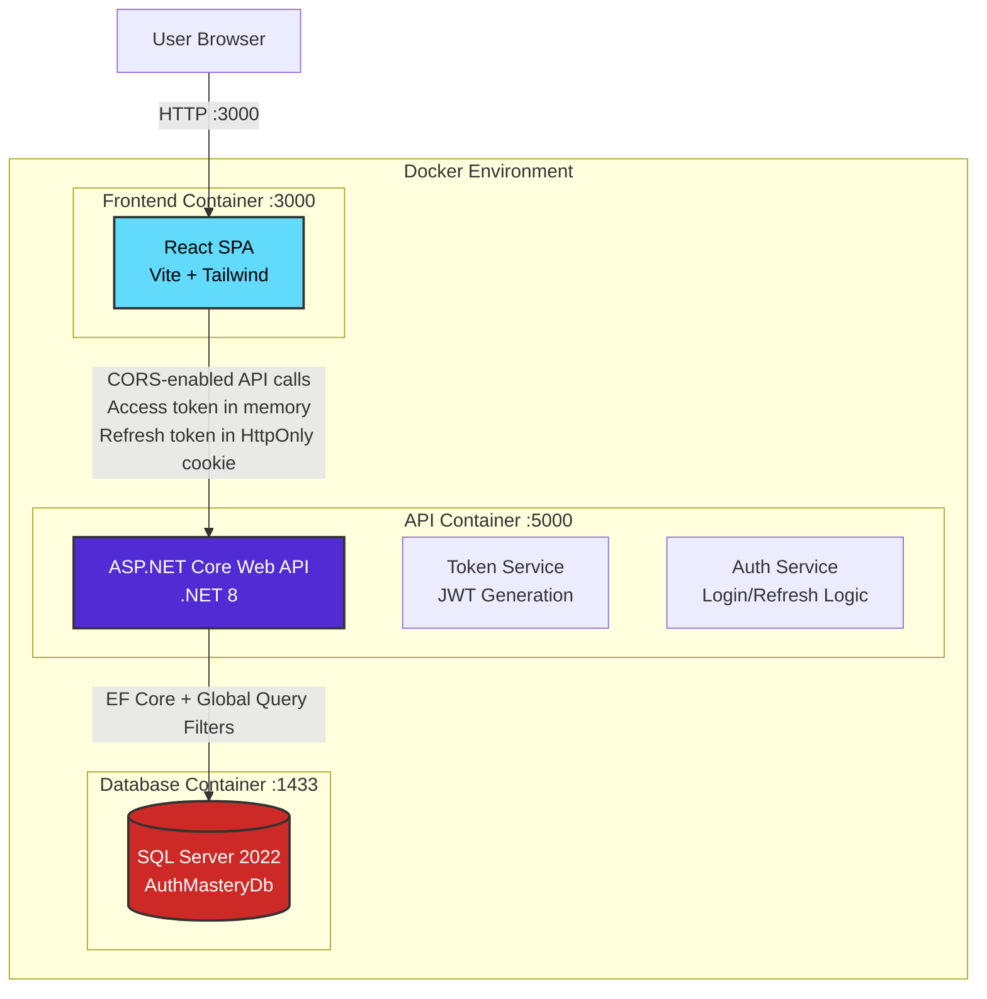
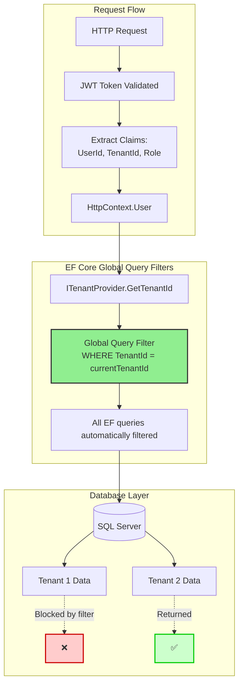
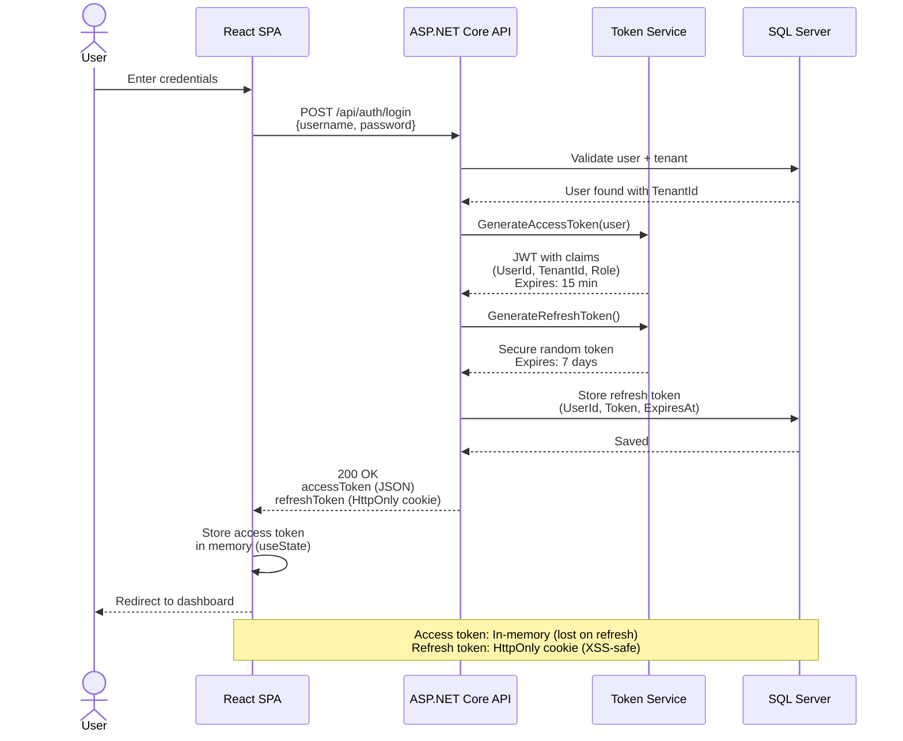
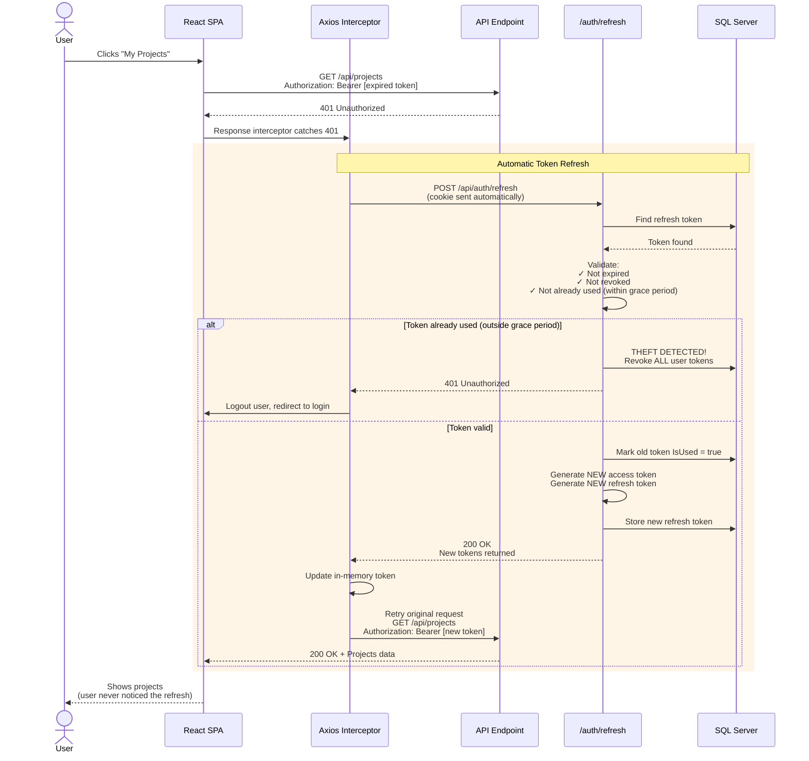

# Architecture & Design Decisions

## System Overview

### Purpose

This system demonstrates production-grade authentication and authorization for a multi-tenant B2B SaaS platform. The architecture addresses three critical challenges that separate demo projects from production systems:

1. **Secure Token Management** - Implementing OAuth 2.0 token flows with rotation and theft detection
2. **Multi-Tenant Data Isolation** - Preventing cross-tenant data access at the database layer
3. **Seamless User Experience** - Building a React SPA that maintains security without sacrificing usability

### Business Context

**Why build custom authentication instead of using Auth0 or AWS Cognito?**

For simple applications, managed services like Auth0 or Cognito are excellent choices. However, custom implementation becomes necessary when:

- **Multi-tenancy requirements** - Complex tenant isolation logic that managed services don't support out-of-the-box
- **Infrastructure as Code limitations** - Cognito requires manual console configuration for many features, creating drift between environments and undocumented manual steps across multiple AWS accounts
- **Cost at scale** - At millions of users, managed auth services become significantly more expensive than self-hosted solutions
- **Compliance and audit requirements** - Full control over audit logging and data retention without provider limitations
- **Custom business logic** - Complex authentication flows that exceed managed service capabilities
- **Future-proofing** - Refactoring from a managed service to custom auth in a live production system is expensive and risky. Building it correctly upfront avoids migration costs, extensive testing across environments, and security risks during the transition.

This implementation follows industry standards (RFC 6749 OAuth 2.0, RFC 7519 JWT) rather than inventing custom protocols. Auth0 and Cognito are implementations of these same standards.

### High-Level Architecture


### Core Components

**Frontend (React SPA)**
- Token storage: Access tokens in memory (React state), refresh tokens in HttpOnly cookies
- Automatic token refresh via axios interceptors
- Protected routing with authentication checks
- Request queuing during token refresh to prevent race conditions

**Backend (ASP.NET Core Web API)**
- Custom JWT token generation and validation
- Refresh token rotation with theft detection
- Multi-tenant data isolation using EF Core global query filters
- Comprehensive logging (Serilog + database audit logs)
- Rate limiting and security headers

**Database (SQL Server)**
- User and tenant management
- Refresh token storage with rotation tracking
- Audit logs for security events
- Global query filters enforce tenant isolation

---

## Design Decisions

### 1. Custom JWT Implementation vs Managed Auth Service

**Decision:** Implement OAuth 2.0 and JWT token flows from scratch. Future migration to OpenIddict is planned to demonstrate understanding of when to use production-grade OAuth libraries.

**Rationale:**
- **Deep understanding** - Building from scratch forces understanding of token signing, validation, claims, and security implications
- **Control** - Full control over token structure, expiration policies, and custom claims (TenantId)
- **Cost** - No per-user pricing at scale (relevant for high-volume B2B SaaS)
- **Compliance** - Unlimited audit logging capabilities without provider restrictions
- **Future flexibility** - Can implement complex custom flows as business requirements evolve

**Alternatives Considered:**
- **Auth0** - Excellent for rapid development, but limited multi-tenant customization and high cost at scale
- **AWS Cognito** - Good AWS integration, but many advanced features require manual console configuration that cannot be fully automated via Infrastructure as Code (CloudFormation/Terraform). This creates environment drift and undocumented manual steps across multiple AWS accounts, making it unsuitable for strict IaC workflows.
- **OpenIddict** - Production-ready OAuth/OIDC server planned for future phases, but implementing custom JWT first builds foundational understanding

**Trade-offs Accepted:**
- More initial development time vs faster managed service setup
- Responsibility for security updates vs delegating to managed provider
- Custom testing requirements vs provider-tested infrastructure

**Production Recommendation:** For real client projects, evaluate based on scale expectations, compliance requirements, and team OAuth expertise. This implementation demonstrates when custom auth is justified.

---

### 2. Refresh Token Rotation with Grace Period

**Decision:** Implement automatic refresh token rotation where each refresh operation generates a new refresh token and marks the old token as used. Include a 5-second grace period to handle network race conditions.

**Rationale:**
- **Theft detection** - If a "used" token is submitted again, the system detects potential theft and revokes all user tokens
- **Limited attack window** - Stolen refresh tokens become invalid after single use (plus grace period)
- **Defense in depth** - Combined with frontend request queuing to handle legitimate retry scenarios

**Alternatives Considered:**
- **No rotation** - Simpler implementation, but stolen refresh tokens remain valid for full 7-day lifetime
- **Rotation without grace period** - Legitimate network retries trigger false-positive theft detection
- **Longer grace period (10+ seconds)** - Reduces false positives but extends window for attackers

**Trade-offs Accepted:**
- Increased complexity (token rotation logic, grace period tracking)
- 5-second window where stolen token remains valid (balanced against false lockout risk)
- Additional database writes on every refresh operation

**Why 5 seconds?** Balances network tolerance (handles slow mobile connections) with security (limits attacker exploitation time). Industry implementations vary: AWS Cognito supports up to 60 seconds ([reference](https://docs.aws.amazon.com/cognito/latest/developerguide/amazon-cognito-user-pools-using-the-refresh-token.html)), while Okta allows 0-60 seconds configurable ([reference](https://developer.okta.com/docs/guides/refresh-tokens/main/)). Our 5-second implementation provides a balanced default that can be adjusted based on network characteristics and security requirements.

---

### 3. Token Storage Strategy

**Decision:** 
- Access tokens stored in memory (React state)
- Refresh tokens stored in HttpOnly cookies with Secure and SameSite=Strict flags

**Why This is the Secure Approach:**

HttpOnly cookies cannot be accessed by JavaScript, protecting tokens from XSS attacks where malicious scripts attempt to steal authentication credentials. SameSite=Strict prevents cookies from being sent in cross-site requests, protecting against CSRF attacks.

Storing tokens in localStorage or sessionStorage exposes them to any JavaScript code running on the page, including malicious scripts injected through XSS vulnerabilities or compromised third-party dependencies.

**Access tokens in memory** (React state) are short-lived (15 minutes) and lost on page refresh, which is acceptable because the automatic refresh flow retrieves a new token seamlessly using the HttpOnly refresh token cookie.

**Cookie Configuration:**
```csharp
Response.Cookies.Append("refreshToken", refreshToken, new CookieOptions
{
    HttpOnly = true,  // JavaScript cannot access
    Secure = true,    // Only sent over HTTPS
    SameSite = SameSiteMode.Strict  // CSRF protection
});
```

---

### 4. EF Core Global Query Filters for Multi-Tenant Isolation

**Decision:** Use Entity Framework Core global query filters to automatically restrict all queries to the current tenant's data.

**Configuration:**
```csharp
modelBuilder.Entity<Project>()
    .HasQueryFilter(p => p.TenantId == _tenantProvider.GetTenantId());
```

**Rationale:**
- **Automatic enforcement** - Impossible for developers to forget tenant filtering; applied at ORM level to all queries
- **Single source of truth** - Tenant resolution logic centralized in `ITenantProvider` service
- **Prevents catastrophic bugs** - Cross-tenant data leaks prevented by default, not by developer discipline
- **Easier code review** - Queries are cleaner without manual `WHERE TenantId = ...` clauses
- **Maintainable** - Adding new tenant-scoped entities automatically inherits filtering

**How It Works:**


**Intentional Bypass:**
When global filters must be bypassed (admin operations, background jobs, database seeding), explicit opt-out is required:
```csharp
var allTenantsData = await _context.Projects
    .IgnoreQueryFilters()  // ⚠️ Requires explicit intent
    .ToListAsync();
```

**Code Review Policy:** Any pull request containing `.IgnoreQueryFilters()` receives extra security scrutiny to validate the business justification.

**Alternatives Considered:**
- **Manual WHERE clauses** - Error-prone; developers can forget, causing data leaks
- **Repository pattern with tenant filtering** - More boilerplate; still possible to bypass by using DbContext directly
- **Database-level row-level security** - More robust but less flexible for complex business logic; requires database-specific features

**Trade-offs Accepted:**
- Slightly less control for complex queries (must use `.IgnoreQueryFilters()` intentionally)
- Requires dependency injection for `ITenantProvider` in DbContext
- Admin operations require explicit filter bypass

---

### 5. Axios Interceptor with Request Queueing

**Decision:** Implement response interceptor that automatically refreshes expired access tokens and queues concurrent requests during refresh operations.

**Why This Approach:**

**Frontend Request Queue:**
- Prevents multiple simultaneous `/refresh` calls when access token expires
- Uses `isRefreshing` flag to detect ongoing refresh operations
- Queues failed API requests and retries them after new token is obtained
- Improves user experience - seamless authentication without repeated login prompts

This works together with the backend grace period (see Design Decision #2 above) to provide defense-in-depth: frontend optimization reduces server load, while backend grace period handles edge cases like direct API calls from mobile apps or testing tools.

---

### 6. Tenant Resolution Strategy

**Decision:** Extract TenantId from JWT claims and inject via `ITenantProvider` service for use in EF Core global query filters.

**How It Works:**

1. **Token Generation** - TenantId included as claim when generating JWT during login
2. **Token Validation** - ASP.NET Core middleware validates JWT and populates `HttpContext.User`
3. **Tenant Provider** - `ITenantProvider` service reads TenantId from claims with validation:
```csharp
public class TenantProvider : ITenantProvider
{
    private readonly IHttpContextAccessor _httpContextAccessor;
    
    public int GetTenantId()
    {
        var tenantIdClaim = _httpContextAccessor.HttpContext?.User
            .FindFirst(CustomClaimTypes.TenantId)?.Value;
        
        if (string.IsNullOrEmpty(tenantIdClaim))
            throw new UnauthorizedAccessException("TenantId claim missing");
            
        if (!int.TryParse(tenantIdClaim, out var tenantId) || tenantId <= 0)
            throw new UnauthorizedAccessException("Invalid TenantId claim");
            
        return tenantId;
    }
}
```
4. **Global Query Filters** - EF Core applies filter automatically using tenant from provider

**Why This Works:**
- Single source of truth (JWT claim) for tenant identity
- No opportunity for developers to pass wrong TenantId manually
- Scoped service lifetime ensures correct tenant per request

---

### 7. Logging Strategy

**Decision:** Dual logging approach using Serilog for application logs and dedicated database table for security audit events.

**Structured Logging (Serilog):**
- JSON-formatted logs with contextual properties
- Correlation IDs for request tracing across services
- Multiple sinks: Console (development), File (production), potential external services (Seq, Elasticsearch)
- Automatic enrichment with request details, tenant context, user identity

**Database Audit Logs:**
- Dedicated `AuditLogs` table for security-critical events
- Captures: token refresh attempts, theft detection, authorization failures, tenant isolation violations
- Queryable history for compliance and incident investigation
- Separate from application logs to ensure persistence even if logging infrastructure fails

**Example Audit Event:**
```csharp
await _context.AuditLogs.AddAsync(new AuditLog
{
    EventType = "TokenTheftDetected",
    UserId = userId,
    TenantId = tenantId,
    Details = "Refresh token reuse detected",
    IpAddress = httpContext.Connection.RemoteIpAddress?.ToString(),
    Timestamp = DateTime.UtcNow
});
```

---

### 8. Database Schema Design

**Decision:** Relational schema optimized for multi-tenant security and audit requirements.

**Core Entities:**

**Users (ASP.NET Identity)**
- Managed by `UserManager<ApplicationUser>`
- Extended with `TenantId` foreign key
- No custom password storage (Identity handles this securely)

**Tenants**
- Simple entity: `Id`, `Name`, `CreatedAt`
- Referenced by all tenant-scoped entities

**RefreshTokens**
- Stores: `Token` (hashed), `UserId`, `ExpiresAt`, `CreatedAt`, `IsRevoked`, `IsUsed`
- **Not tenant-scoped** - tokens validated at user level, not tenant level
- Indexed on `UserId` for fast lookup during refresh operations
- Includes `CreatedAt` for cleanup queries (delete tokens older than 30 days)

**Projects (Sample Domain Entity)**
- Tenant-scoped with `TenantId` foreign key
- Global query filter automatically applied
- Demonstrates typical multi-tenant data pattern

**AuditLogs**
- Security events, not tenant-scoped (admin can view across all tenants if needed)
- Indexed on `Timestamp` and `EventType` for efficient querying

**Why RefreshTokens Are Not Tenant-Scoped:**
Refresh tokens authenticate users, not tenant access. Since a user belongs to exactly one tenant, validating tokens at the user level is sufficient - tenant isolation happens at the data access layer via global query filters.

---

## Authentication Flow

The following diagram shows the complete login and token generation process:


---

## Token Refresh Flow

When an access token expires, the following automatic refresh process occurs:


---

---

## Scalability & Production Readiness

### Current Scale (Appropriate for Demo/MVP)
- Single API container, single database instance
- Access tokens stored in browser memory (lost on page refresh, automatically refreshed)
- No distributed caching, manual Docker Compose deployment
- Works well for development, testing, and MVP with <1,000 active users

---

### Scaling to 1,000,000 Users

**Initial Bottlenecks (10,000+ users):**
- Database connection pool exhaustion (solution: read replicas, connection pool tuning)
- No caching layer causing repeated queries (solution: Redis for tenant/user lookups)
- Token refresh spikes every 15 minutes (solution: stagger expiration, rate limiting)
- Unbounded audit log growth (solution: partition by date, archive to cold storage)

**Architecture Changes Required:**

**1. Horizontal Scaling**
- Multiple API instances behind load balancer (ALB/NLB)
- Stateless design already supports this (no server-side session state)
- Sticky sessions NOT required (tokens in cookies handle state)

**2. Database Optimization**
- **Read replicas** for query endpoints (projects, user data)
- **Write-through caching** for user/tenant lookups (Redis)
- **Separate database** for audit logs (different performance characteristics)
- **Index optimization** on `RefreshTokens.UserId`, `RefreshTokens.CreatedAt`

**3. RefreshTokens Table Cleanup**
- **Background job** (Hangfire, AWS Lambda scheduled) to delete expired tokens
- Query: `DELETE FROM RefreshTokens WHERE CreatedAt < DATEADD(day, -30, GETUTCDATE()) AND (IsRevoked = 1 OR IsUsed = 1)`
- *Note: This uses SQL Server syntax. For PostgreSQL, use `CURRENT_TIMESTAMP - INTERVAL '30 days'`. In production, implement via Hangfire or scheduled Lambda function.*
- Keep active unused tokens until natural expiration
- Run daily during off-peak hours

**4. Rate Limiting**
- **Per-user rate limits** on `/auth/refresh` endpoint (prevent abuse)
- **Per-IP rate limits** on `/auth/login` endpoint (prevent brute force)
- Implement using ASP.NET Core middleware or API Gateway (AWS API Gateway, Kong)

**5. Monitoring & Observability**
- Distributed tracing (correlation IDs already implemented)
- Centralized logging (Elasticsearch, CloudWatch Logs)
- Metrics dashboards (Grafana, CloudWatch) for:
  - Token refresh rate
  - Failed authentication attempts
  - Tenant isolation violations
  - Database connection pool utilization

**6. Geographic Distribution**
- Multi-region deployment with regional databases
- Tenant data partitioned by region for GDPR compliance
- Global load balancer routes requests to nearest region

---

## Production Deployment Recommendations

- **Infrastructure:** Container orchestration (Kubernetes/ECS), managed database (RDS/Azure SQL), secrets management (Secrets Manager/Key Vault), CDN for static assets
- **Security:** TLS 1.3, security headers (HSTS, CSP), DDoS protection, WAF rules
- **Compliance:** GDPR (data export/deletion), SOC 2 (encryption, audit logs), PCI DSS if handling payments

---

## What's NOT Implemented (Intentional Scope Limits)

This is a **learning project** demonstrating authentication patterns. The following are deliberately excluded:

**1. Email Verification**
- Production requirement, not essential for authentication architecture demonstration

**2. Password Reset Flow**
- Standard feature, but doesn't showcase interesting technical patterns

**3. Two-Factor Authentication (2FA)**
- Adds complexity without demonstrating core OAuth/JWT concepts
- Would be essential for production financial/healthcare applications

**4. Social Login (OAuth providers)**
- Focuses on custom JWT implementation to build foundational understanding
- Real systems would integrate Auth0, Okta, or custom OIDC provider

**5. Role-Based Access Control (RBAC) Beyond Basic Roles**
- Basic role checking implemented
- Fine-grained permissions system (claims-based, attribute-based) not built

**6. API Versioning**
- Production APIs need versioning strategy
- Not relevant to authentication architecture demonstration

**7. GraphQL Support**
- REST API chosen for simplicity
- Same authentication patterns apply to GraphQL

---

## Future Enhancements

**OpenIddict Migration (Future Phase)**
- Migrate from custom JWT implementation to OpenIddict
- Demonstrates understanding of when to use production-grade OAuth libraries
- Implements Authorization Code flow (more secure than current implementation)
- Adds OpenID Connect support (standardized user info endpoint)

---

## Key Takeaways

**What This Project Demonstrates:**

1. **Deep understanding of OAuth 2.0 and JWT** - Not just using a library, but implementing the standards
2. **Production-grade security patterns** - Token rotation, theft detection, HttpOnly cookies, grace periods
3. **Multi-tenant architecture** - Automatic tenant isolation at the database level
4. **Scalability awareness** - Understanding bottlenecks and how to address them
5. **Defense in depth** - Multiple layers of security (frontend queue + backend grace period)

**When to Use This Approach:**

- B2B SaaS platforms requiring strict multi-tenant isolation
- Applications with complex custom authentication requirements
- Systems where Auth0/Cognito costs become prohibitive at scale
- Compliance-heavy industries (finance, healthcare) needing full audit control

**When NOT to Use This Approach:**

- Simple CRUD applications without multi-tenancy
- Rapid MVP development where time-to-market is critical
- Small teams without security expertise to maintain custom auth
- Consumer applications where social login is primary authentication method

---

*This architecture document covers design decisions and system structure. For detailed security implementation including token rotation mechanics, theft detection logic, and attack mitigations, see [Security.md](./Security.md).*

