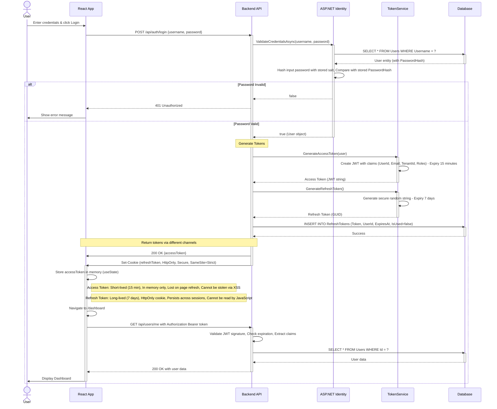

```mermaid
sequenceDiagram
    actor User
    participant React as React App
    participant API as Backend API
    participant Identity as ASP.NET Identity
    participant TokenSvc as TokenService
    participant DB as Database

    User->>React: Enter credentials & click Login
    
    React->>API: POST /api/auth/login {username, password}
    activate API
    
    API->>Identity: ValidateCredentialsAsync(username, password)
    activate Identity
    
    Identity->>DB: SELECT * FROM Users WHERE Username = ?
    activate DB
    DB-->>Identity: User entity (with PasswordHash)
    deactivate DB
    
    Identity->>Identity: Hash input password with stored salt, Compare with stored PasswordHash
    
    alt Password Invalid
        Identity-->>API: false
        API-->>React: 401 Unauthorized
        React->>User: Show error message
    else Password Valid
        Identity-->>API: true (User object)
        deactivate Identity
        
        Note over API: Generate Tokens
        
        API->>TokenSvc: GenerateAccessToken(user)
        activate TokenSvc
        TokenSvc->>TokenSvc: Create JWT with claims (UserId, Email, TenantId, Roles) - Expiry 15 minutes
        TokenSvc-->>API: Access Token (JWT string)
        deactivate TokenSvc
        
        API->>TokenSvc: GenerateRefreshToken()
        activate TokenSvc
        TokenSvc->>TokenSvc: Generate secure random string - Expiry 7 days
        TokenSvc-->>API: Refresh Token (GUID)
        deactivate TokenSvc
        
        API->>DB: INSERT INTO RefreshTokens (Token, UserId, ExpiresAt, IsUsed=false)
        activate DB
        DB-->>API: Success
        deactivate DB
        
        Note over API,React: Return tokens via different channels
        
        API->>React: 200 OK {accessToken}
        API->>React: Set-Cookie (refreshToken, HttpOnly, Secure, SameSite=Strict)
        deactivate API
        
        activate React
        React->>React: Store accessToken in memory (useState)
        
        Note right of React: Access Token: Short-lived (15 min), In memory only, Lost on page refresh, Cannot be stolen via XSS
        
        Note right of React: Refresh Token: Long-lived (7 days), HttpOnly cookie, Persists across sessions, Cannot be read by JavaScript
        
        React->>React: Navigate to /dashboard
        
        React->>API: GET /api/users/me with Authorization Bearer token
        activate API
        
        API->>API: Validate JWT signature, Check expiration, Extract claims
        
        API->>DB: SELECT * FROM Users WHERE Id = ?
        activate DB
        DB-->>API: User data
        deactivate DB
        
        API-->>React: 200 OK with user data
        deactivate API
        
        React->>User: Display Dashboard
        deactivate React
    end
```
