# Authentication Mastery Project

**Production-grade, multi-tenant authentication system**

Not just another auth tutorial. This project implements advanced patterns like refresh token rotation with automatic theft detection, database-level tenant isolation, and comprehensive rate limiting—features you'd find in production SaaS applications.

**Learning goal:** Build JWT authentication from first principles before migrating to production frameworks. Understanding the fundamentals makes you better at using the tools.

---

## 🔐 Key Features

### 🔐 Security-First Authentication
- **JWT tokens** with HMAC-SHA256 signing and custom claims
- **Refresh token rotation** - new token issued on every refresh
- **Theft detection** - revokes all tokens if reuse detected
- **HttpOnly cookies** for refresh tokens (XSS-safe)
- **In-memory access tokens** (no localStorage vulnerabilities)

### 🏢 Multi-Tenant Architecture
- **Global query filters** in EF Core (automatic tenant isolation)
- **Tenant-scoped data** - impossible to access other tenant's data
- **Role-based authorization** with custom policies

### 🛡️ Production-Grade Security
- **Rate limiting** (5 login attempts/min, prevents brute force)
- **Security headers** (HSTS, CSP, X-Frame-Options, X-Content-Type-Options)
- **Structured logging** with Serilog (request tracking, audit trails)
- **Health checks** for monitoring and container orchestration

### ⚛️ Modern React SPA
- **Axios interceptors** for automatic token refresh
- **Silent token refresh** before expiration (seamless UX)
- **Concurrent request handling** (queues requests during refresh)
- **Protected routes** with role-based rendering

---

## 📸 Screenshots

<details>
<summary>Click to expand screenshots</summary>

### Login Form

*Clean login interface with rate-limited authentication*

### Projects Page

*Protected routes with CRUD and role-based access*

### Admin Dashboard

*Admin-only view demonstrating authorization*

### Rate Limit

*Protection against brute-force*

### Health Check

*Monitoring endpoint*

### Docker Compose

*Three healthy containers*

</details>

---

## 🚀 Quick Start

### Prerequisites
- [Docker](https://www.docker.com/get-started) & Docker Compose
- [Git](https://git-scm.com/)

### Environment Setup
Copy `.env.example` to `.env` and fill in the required values:

```bash
cp .env.example .env
# Then edit .env with your values
```

Required variables:
- `MSSQL_SA_PASSWORD` - SQL Server password (min 8 chars, mixed case, numbers, special chars)
- `Jwt__Secret` - JWT signing key (min 32 characters, generate with `openssl rand -base64 32`)
- `Jwt__RefreshTokenSecret` - Refresh token hashing key (min 32 characters)

**Important:** Use strong, unique values for production. These secrets are used for database access and JWT token signing.

### Run the Application
```bash
# Clone the repository
git clone https://github.com/yourusername/auth-mastery.git
cd auth-mastery

# Create .env file (see Environment Setup above)
# Then start all containers
docker-compose up -d

# Wait ~30 seconds for SQL Server to initialize
```

### Access the Application

- **Frontend (HTTP - Recommended):** http://localhost:3000 - No browser warnings
- **Frontend (HTTPS - Optional):** https://localhost:3001 - Self-signed cert, browser will warn
- **API (HTTPS):** https://localhost:5000 - Self-signed cert, browser will warn
- **Health Check:** https://localhost:5000/health

> **Note on HTTPS**
>
> This project uses self-signed certificates for HTTPS in Docker, demonstrating production-grade architecture (proper certificate generation, secure proxy configuration, HTTPS-only API) while keeping local development simple.
>
> **For development:** I recommend using `http://localhost:3000` to avoid browser certificate warnings. The API always uses HTTPS (production-like behavior) while the frontend supports both HTTP and HTTPS for demo convenience.
>
> **For production:** You would use:
> - Valid SSL certificates from Let's Encrypt or a Certificate Authority
> - Reverse proxy (nginx, Traefik, Cloudflare) handling TLS termination
> - All traffic over HTTPS with trusted certificates

### Default Credentials

**Tenant acme:**
- Regular User: `mike@acme.com` / `Password123!`
- Admin User: `john@acme.com` / `Password123!`

**Tenant widgets:**
- Regular User: `diana@widgets.com` / `Password123!`
- Admin User: `bob@widgets.com` / `Password123!`

---

## 🏗️ Architecture Diagrams

### System Architecture


Three containerized services work together: React frontend handles secure token management, ASP.NET Core API provides JWT authentication with refresh token rotation, and SQL Server stores data with automated migrations. This architecture enables independent scaling and deployment of each component.

---

### Authentication Flow


This flow demonstrates the separation of concerns: access tokens are short-lived (15 minutes) and stored in memory, while refresh tokens are long-lived (7 days) and stored in HttpOnly cookies. The short access token lifetime limits exposure if stolen, while the refresh token enables seamless user experience.

---

### Token Refresh & Theft Detection

```mermaid
sequenceDiagram
    actor User
    participant React as React SPA
    participant Interceptor as Axios Interceptor
    participant API as API Endpoint
    participant RefreshAPI as /auth/refresh
    participant DB as SQL Server
    
    User->>React: Clicks "My Projects"
    React->>API: GET /api/projects<br/>Authorization: Bearer [expired token]
    API-->>React: 401 Unauthorized
    
    React->>Interceptor: Response interceptor catches 401
    
    rect rgb(255, 245, 230)
        Note over Interceptor,DB: Automatic Token Refresh
        Interceptor->>RefreshAPI: POST /api/auth/refresh<br/>(cookie sent automatically)
        
        RefreshAPI->>DB: Find refresh token
        DB-->>RefreshAPI: Token found
        
        RefreshAPI->>RefreshAPI: Validate:<br/>✓ Not expired<br/>✓ Not revoked<br/>✓ Not already used
        
        alt Token already used (IsUsed = true)
            RefreshAPI->>DB: THEFT DETECTED!<br/>Revoke ALL user tokens
            RefreshAPI-->>Interceptor: 401 Unauthorized
            Interceptor->>React: Logout user, redirect to login
        else Token valid (first use)
            RefreshAPI->>DB: Mark old token IsUsed = true
            RefreshAPI->>RefreshAPI: Generate NEW access token<br/>Generate NEW refresh token
            RefreshAPI->>DB: Store new refresh token
            RefreshAPI-->>Interceptor: 200 OK<br/>New tokens returned
            
            Interceptor->>Interceptor: Update in-memory token
            Interceptor->>API: Retry original request<br/>GET /api/projects<br/>Authorization: Bearer [new token]
            API-->>React: 200 OK + Projects data
        end
    end
    
    React-->>User: Shows projects<br/>(user never noticed the refresh)
```


Token rotation prevents replay attacks: each refresh invalidates the previous token and issues a new one. If an attacker steals a refresh token and uses it, the legitimate user's next refresh attempt will detect the theft (token already marked as used) and immediately revoke all tokens. This is a production-grade pattern used by GitHub, Auth0, and other security-focused platforms.

---

### Multi-Tenant Data Isolation


Global query filters ensure tenant isolation at the database layer, not just the application layer. Even if a developer forgets to add tenant filtering in a query, EF Core automatically applies the filter. This fail-safe default prevents accidental data leaks and enforces security by design rather than by convention.

---

## 🛡️ Security Features

### Rate Limiting
| Endpoint | Limit | Purpose |
|----------|-------|---------|
| `POST /api/auth/login` | 5 req/min | Prevent brute-force attacks |
| `POST /api/auth/refresh` | 5 req/min | Prevent token grinding |
| All other endpoints | 100 req/min | Prevent DoS attacks |

### Security Headers
- **HSTS** - Forces HTTPS connections
- **X-Content-Type-Options** - Prevents MIME sniffing attacks
- **X-Frame-Options** - Prevents clickjacking
- **Content-Security-Policy** - Mitigates XSS attacks

### Audit Logging
All authentication events are logged with Serilog: login attempts, refresh token usage, and revocation events. Failed login attempts are tracked with IP addresses for security monitoring.

---

## 🛠️ Tech Stack

| Backend | Frontend |
|---------|----------|
| ASP.NET Core 8 | React 18 |
| EF Core | Vite |
| ASP.NET Identity | Tailwind CSS |
| JWT Bearer Authentication | Axios |
| Serilog | React Router |
| SQL Server 2022 | |

**DevOps:** Docker, Health Checks, CORS

---

## 📚 Documentation Links

For deep dives into implementation details:

- **[Architecture & Design Decisions](Docs/ARCHITECTURE.md)** - System design, flows, detailed diagrams, why I made specific architectural choices
- **[Security Implementation](Docs/SECURITY.md)** - Token rotation mechanics, theft detection logic, multi-tenant isolation strategy, rate limiting policies

## 🔍 API Documentation

In development mode, Swagger UI is available at `https://localhost:5000/swagger` for interactive API exploration and testing.

## 🐛 Troubleshooting

**SQL Server won't start:**
- Check Docker logs: `docker logs authmastery-sqlserver`
- Ensure port 1433 is not in use: `netstat -an | findstr 1433`
- Verify `.env` file exists with `MSSQL_SA_PASSWORD` set

**Certificate errors:**
- Accept the self-signed certificate in your browser, or
- Use `http://localhost:3000` for the frontend (recommended for development)

**Rate limit errors:**
- Wait 1 minute between login attempts (5 attempts per minute limit)
- Check rate limit headers in response: `Retry-After`

**Database connection issues:**
- Wait ~30 seconds after `docker-compose up` for SQL Server to initialize
- Check health endpoint: `https://localhost:5000/health`
- Verify environment variables are set correctly

---

## 🎓 What I Learned

### Technical Skills
- **JWT internals** - Not just using a library, but understanding claims, signing, validation
- **OAuth2 patterns** - Refresh token rotation, bearer tokens, token lifecycle management
- **React security** - Why memory storage beats localStorage, how to handle tokens securely
- **EF Core advanced features** - Global query filters, performance implications, multi-tenancy patterns
- **Docker orchestration** - Health checks, container dependencies, networking

### Architectural Thinking
- **Security by design** - Every decision evaluated for security implications
- **Trade-offs matter** - 15-min tokens (security) vs user experience (frequent refreshes)
- **Defense in depth** - Multiple layers (rate limiting + strong passwords + token rotation)
- **Fail-safe defaults** - Global query filters ensure tenant isolation even if developer forgets

### What Surprised Me
- **Token rotation complexity** - Simple concept, tricky edge cases (network delays, concurrent requests)
- **React state management** - Handling auth state across components is harder than it looks
- **Docker timing issues** - SQL Server health checks critical for reliable startup

---

## 🚧 What's NOT Included

This project focuses on authentication fundamentals. The following are intentionally out of scope:

- ❌ **Email verification** - Would add email service complexity
- ❌ **Password reset flow** - Requires email infrastructure
- ❌ **2FA/MFA** - Future enhancement
- ❌ **OAuth providers** (Google, GitHub) - Focused on custom implementation first
- ❌ **Account lockout** - Using Identity defaults only
- ❌ **Comprehensive test suite** - Demonstrated testing approach with sample tests

**Why these exclusions?** This project demonstrates authentication architecture and security patterns. Adding these features would dilute focus without adding new learning.

---

## 🔮 Future Enhancements

- [ ] **Migrate to OpenIddict** (separate branch) - Compare custom vs framework approach
- [ ] **Comprehensive test coverage** - Unit + integration tests for all auth flows
- [ ] **Refresh token family tracking** - More sophisticated theft detection
- [ ] **Audit log UI** - Visualize security events
- [ ] **API versioning** - Prepare for breaking changes
- [ ] **Kubernetes deployment** - Scale beyond Docker Compose

---

## 📝 License & Acknowledgments

**MIT License** - feel free to use this for learning or as a foundation for your projects.

Built as a learning project to deeply understand authentication before using production frameworks. Inspired by security best practices from Auth0, Duende IdentityServer, and OWASP guidelines.

---

**Questions? Found a bug? Open an issue or reach out!**
